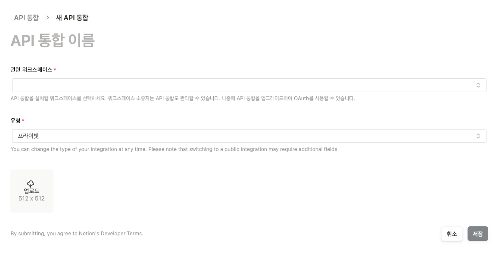

# Notion Jandi Webhook

> ### __*Notion Database - Jandi 를 연동하는 API 입니다.*__
> 
> 명지전문대학 Internship 운영을 위해 제작했습니다.
>>동작 과정  
>> 1. API는 60초마다 연동된 Notion DataBase에 접근합니다.
>>```
>> Notion 개발자 페이지에서 통합 API Key가 필요합니다.
>> 생성된 API Key를 Notion Workspace에 Connection 해줘야 합니다.
>> Notion Database의 ID가 필요합니다. 
>>```
>> 2. Database의 생성일시(Create DateTime)를 마지막으로 비교했던 시간(lastCheckedTime)과 비교합니다.
>>```
>> Notion Database에서 제공하는 Create Date는 분단위까지 입니다. (초단위는 00으로 고정)
>>```
>> 3. lastCheckedTime과 같거나 크면 잔디로 Database 요소들을 가공하여 전송합니다.
>>```
>> 메세지를 전송받을 Jandi 토픽에서 수신 Webhook을 사용하여 Connector로 설정합니다. 
>>```
---
## Notion API Key 발급 및 Connection
#### [Notion 개발자 페이지](https://www.notion.so/profile/integrations)  
### 1. 새 API 통합 생성
- API 통합을 생성하여 Key를 발급받습니다.


### 2. API Auth 설정  
- API Key는 API 호출 통신시 사용됩니다.   


### 3. Workspace Connection
- 생성한 API를 연결 항목에서 선택하여 연결합니다. 비연결시 API 호출에 404 Error가 발생합니다.    


### 4. Notion DataBase ID 확인하기
- DataBase View를 통해 Page로 들어가고 링크를 복사했을때 Notion URL 뒤와 QueryString 까지가 Database의 ID입니다    
  

---
## Jandi 수신 Webhook URL 발급
### 1. Jandi Connector Webhook 수신 연동 추가
- 메세지를 받을 토픽에서 연동을 추가합니다.  


### 2. Jandi Connector Webhook URL  
- URL은 API에서 전송될 토픽으로 사용됩니다.


---
## 작업예정 사항
### 1. Key값, ID, URL ConfigMap화
### 2. 간단한 Helm Chart로 구동할 수 있게끔 Helm Chart 작성